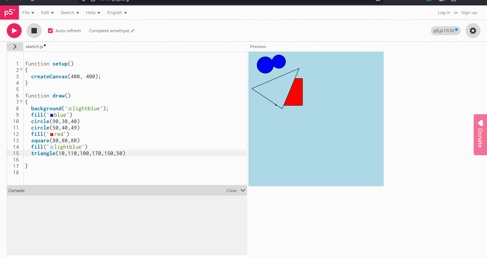

# Weekly Journal 01

## Exploration & Experimentation

This journal exists for one reason: to prove that my creative progression happened in real life and not just in my imagination at 2am. Week 1 was the classic p5.js “I can draw a circle therefore I am an artist” moment. I played with createCanvas() sizing, tried different background() values, and tested shapes like ellipse() and rect() while figuring out that coordinates are not vibes, they are numbers with opinions. I remember nudging positions manually like “okay, if I put this at x = 50 it looks lonely, but x = 100 looks like it made friends,” and then realizing I should stop eyeballing everything and use variables like centerX = width/2 and centerY = height/2.

And then: tragedy. I had no account. Meaning I did the work, and the universe said, “Cute. Delete.” So yes, my earliest progress is basically a mythical creature now. But I did capture what I could, including the written code in the image, because apparently my first lesson wasn’t p5.js, it was “make an account or suffer.”

### First Image

## Influences & References
This first week didn’t start with a deep art-history rabbit hole, but it did start a pattern: I’m drawn to simple forms that can read like characters or symbols. A circle isn’t just a circle for long before it becomes a face, an eye, or honestly… a tiny planet. The earliest influence was just the “language” of minimal marks: if I place two dots and a curve inside a circle, the viewer’s brain supplies the rest. That little trick is basically the gateway drug to generative symbolism huehuehue. Behold the face.


<iframe src="https://editor.p5js.org/Anna-Stacy/full/jWUlwWc8I" width="100%" height="450" frameborder="no"></iframe>


### Algorithmic Thinking
My “machine imaginaire” in Week 1 was extremely straightforward: define the space, then place shapes using rules, even if the rules were tiny. The logic for a smiley is basically a recipe. If the canvas is width by height, then the face sits at (width/2, height/2). If the face radius is r, then the eyes sit at (centerX ± r*0.25, centerY - r*0.15) and the mouth sits below center. Even when it looks “cute and simple,” the computer is doing exactly what it is told, in exactly the order I wrote it. There is no mercy and no “it’s what I meant.”

## Critical Reflection
What worked: I learned the basics fast enough to make something recognizable, which is honestly a small miracle when you’re staring down coordinate systems for the first time. What failed: my entire unsaved progress and my dignity. But that failure forced me to treat process as reproducible, not magical.  
Next step: control and interaction. If I can make a drawing respond to me, maybe I can eventually make it feel like it transitions, like night sliding into day instead of everything snapping instantly.

#### The only question is WHYYY MEE
Aka look who made an account :D <- Smiley face