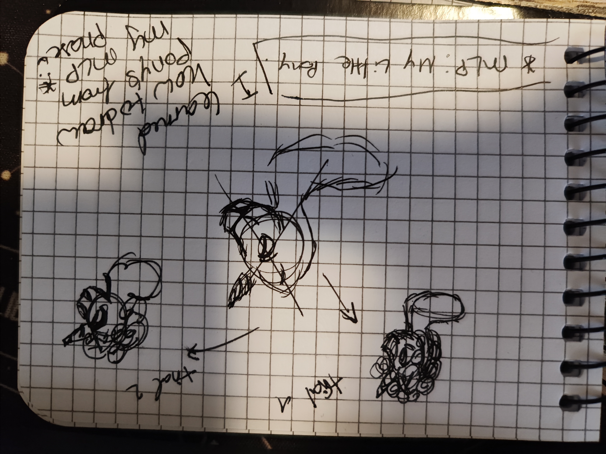

# Weekly Journal 06

## Exploration & Experimentation

This week contained two events: a family thing, and my feedback session with my nephew and niece.  My niece used to tell me I’m a unicorn, when she was younger (2-4 years old), so I decided to become the unicorn. Their feedback being mainly that I should start getting more creative. Which I took to heart. So now I go back into my imagination about unicorns. I made a unicorn sketch with my thought process visible.  
I used to have a big My Little Pony phase, so I became pretty good at drawing different kind of ponies. 
## Unicorn Sketch


For the p5.js generative image I tested movement by shifting small elements frame-by-frame, trying to create “sparkly magic” instead of “static sticker.” I also experimented with breaking the drawing into parts so I could tweak features without rewriting everything. Horn too big? Adjust the horn length variable. Eyes too cursed? Reduce the eye height. (This is how I learned that character design is 50% math and 50% emotional resilience.)

### Image: Unicorn sketch built from shapes, with early frustration visible

<iframe src="https://editor.p5js.org/Anna-Stacy/full/3KaGltaaH" width="100%" height="450" frameborder="no"></iframe> 


## Influences & References
I did what any sane person does when coding a unicorn: I skimmed the internet for unicorn p5.js references like I was shopping for mythical livestock. These links mattered because they helped me see how other people structured their code, especially for modular drawing and interaction.

Very first inspiration after research: [Functions-Unicorn by codingtrain](https://editor.p5js.org/codingtrain/sketches/j2YhLFhxU)


Cute Unicorn 
Unicorn game: [UNICORN by ps218478](https://editor.p5js.org/ps218478/sketches/0SbhkfBRU)

This was my second attempt after my initial try, I believe this came out quite well, using the two above mentioned artists as inspiration. 


<iframe src="https://editor.p5js.org/Anna-Stacy/full/HaPxYpIDR" width="100%" height="450" frameborder="no"></iframe> 
  


## Algorithmic Thinking

The algorithm here is a static character. I wanted to imitate a peaceful unicorn with simple functions. Here is a paste on the details needed, as well as patience. 
```js
//  Face Details :,D
  
  // Eyes (Closed, happy)
  noFill();
  stroke(0);
  strokeWeight(3);
  arc(-40, 10, 35, 35, 30, 150); // Left eye
  arc(40, 10, 35, 35, 30, 150); // Right eye
  
  // Eyelashes
  strokeWeight(2);
  line(-58, 18, -68, 15); // Left
  line(-54, 20, -64, 10);
  line(58, 18, 68, 15); // Right
  line(54, 18, 64, 10);

  // Nostrils
  fill(0);
  noStroke();
  ellipse(-30, 60, 6, 8); // Left
  ellipse(30, 60, 6, 8); // Right
  
  // Mouth (Happy smile)
  noFill();
  stroke(0);
  strokeWeight(3);
  arc(0, 100, 50, 50, 20, 160);
```


## Critical Reflection
What worked: I started coding like a person who plans, not like a person who panics (progress!). Breaking drawings into parts was huge for me. 

What failed: my pride, occasionally, when proportions looked wrong and the unicorn stared into my soul. But feedback pushed me forward.

Next step: make motion. I want controlled change, like a gradual shift between moods.


