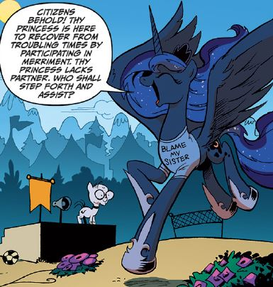

# Weekly Journal 08 - Start on Final Project

## Exploration & Experimentation

I decided to fight randomness, taking a break from my research from last week and cheer me up.

I tried generating random images and created a SPECTACULAR failure that I now cherish like a cursed artifact. But it gave me an idea: rainbows. I was feeling under the weather (seasonal changes are rude), so I decided to code serotonin.

The journey was not peaceful. I iterated through multiple versions, tweaking spacing, arc thickness, and color order until it stopped looking like an accident. The “final version” was the moment I finally controlled the "output" instead of it controlling me. (Did you get the life reference aout control? Hehe)

#### Image: The first chaotic rainbow failure, messy arcs and unpredictable colors
### My painful journey

<iframe src="https://editor.p5js.org/Anna-Stacy/full/V0BJjlswp" width="100%" height="450" frameborder="no"></iframe>


### Final version that made me happy ^^ <- that is a smiley.

<iframe src="https://editor.p5js.org/Anna-Stacy/full/YRGCOkbjL" width="100%" height="450" frameborder="no"></iframe>


## Influences & References
This week’s influences were more emotional than academic, but technically the rainbow is a perfect lesson in transition and interpolation. A rainbow is a gradient with structure. That matters because my final direction (Light/Dark) is also about transitioning between states, just with atmosphere instead of pure spectrum. Rainbows taught me that smooth changes look intentional and calming, while harsh jumps look like my laptop is haunted.

## Algorithmic Thinking
The system was a layered arc generator. The rules were: draw multiple arcs from largest to smallest, reduce radius each time by a spacing value, and assign colors in a controlled order. The key algorithmic decision was limiting randomness. Instead of randomizing everything, I kept the center stable and controlled the radius steps, so the output stayed readable. The machine imaginaire here is basically: “Build a structured spectrum one band at a time.”

## Critical Reflection
What worked: persistence and parameter control. 

What failed: my emotional stability for a moment, but we survived. This week actually mattered a lot because it taught me that transitions are aesthetic decisions that come from math, spacing, mapping, interpolation.

Next step: apply this lesson to mood transitions (warm/cool) rather than rainbow transitions, because I’m definitely heading toward a night/day system after this. Why? My niece reminded me of my My Little Pony phase, also, my third name is Luna, which is the name of the Princess of the night. Basically gifting me the idea. Thank you my namesake hehe. 
  
[ source](https://www.google.com/url?sa=t&source=web&rct=j&url=https%3A%2F%2Fmlpforums.com%2Ftopic%2F133078-how-would-you-describe-princess-lunas-personality%2F&ved=0CBUQjRxqFwoTCMiPvM3P5pEDFQAAAAAdAAAAABAH&opi=89978449)

