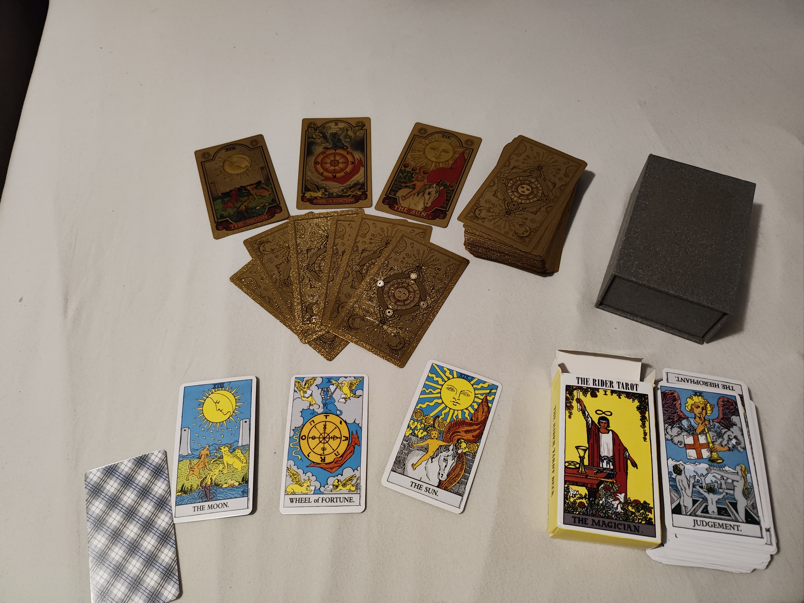

# Weekly Journal 10 - Final Project Research
## Exploration & Experimentation

This week’s pixel focus made me think about facades, not mirror reflections, but the masks we wear. Pixels are literally a mask: tiny squares that pretend they’re smooth reality when you zoom out.

I started imagining the sun/moon as a recurring “watermark” motif in my work. Something small but persistent, like a reminder that light and dark both exist, and you don’t get one without the other. I didn’t finalize anything yet, but the concept started to solidify: central celestial ancient feeling icons, shifting atmosphere, and a system that reveals different sides.

## Influences & References
This week’s influence was tarot card designs. Specifically, my tarot card sets. 

## Algorithmic Thinking
None, this was research based for the fundamental artistic design change. From coins to geometrically styled celestial bodies. 

## Critical Reflection
What worked: Finding my artistic style for the final project.

What failed: Knowing it will be a struggle finding complex inspirations for geometric tarot shapes the way they are portrayed in the image above. 

Next step: I want to make a trial art. I want to use layering: a smooth gradient background, a clear central disc, and state-based details like stars. 