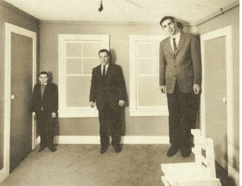
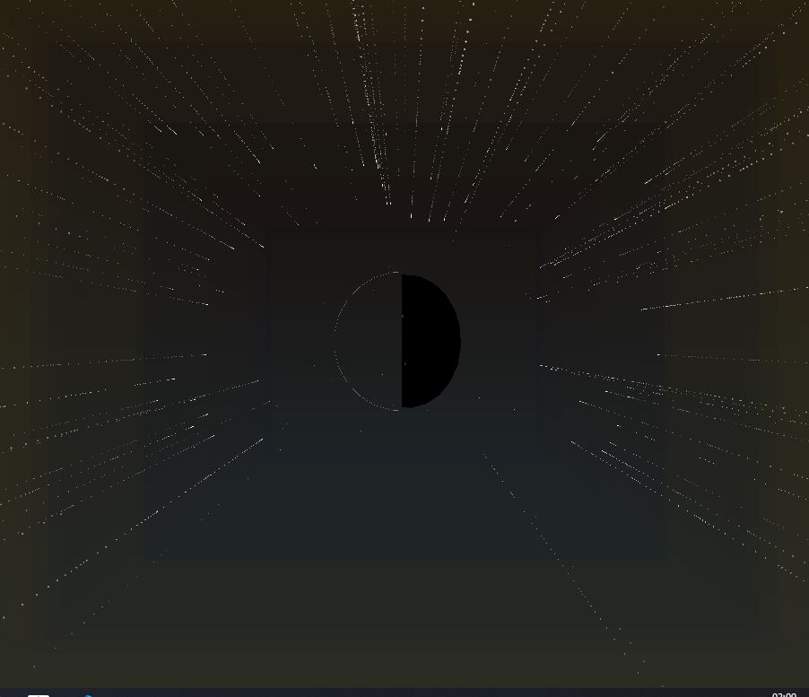

# Weekly Journal 13 - Final Project Last Tweaks

## Exploration & Experimentation

This week was workshop week, which meant refinement. I started merging the pieces: rotation, a two-palette system (warm sun vs cool moon), and background atmosphere. I started on the presentation for the final week as well. 

I saw this as an opourtunity to see misshaps as an artistic choice, as mentioned in week 12, next steps.
The idea with the frames was also heavily inspired by the artist Adelbert Ames Jr. (1880-1955) with the Ames Room optical illusion.
[A very interesting blog about him :)](https://davidcycleback.substack.com/p/adelbert-ames-mind-bending-illusions)

 After this inspirational struck, I decided to test stars and how many feel like glitter spilled everywhere (spoiler, its not good to add over 5000...).  
 I adjusted density and twinkle speed until it felt like a night sky instead of an LED wall.

## Influences & References
Based on Adelbert Ames Jr. (1880-1955). I leaned into systematic variation, one object, many states. Depending on the location the frames get smaller or bigger depending on location. Giving the user the autonomy to frame to their own desire. (By leftclicking on the image with the cursor)

## Algorithmic Thinking
Listen to next weeks presentation to find ut ;)
