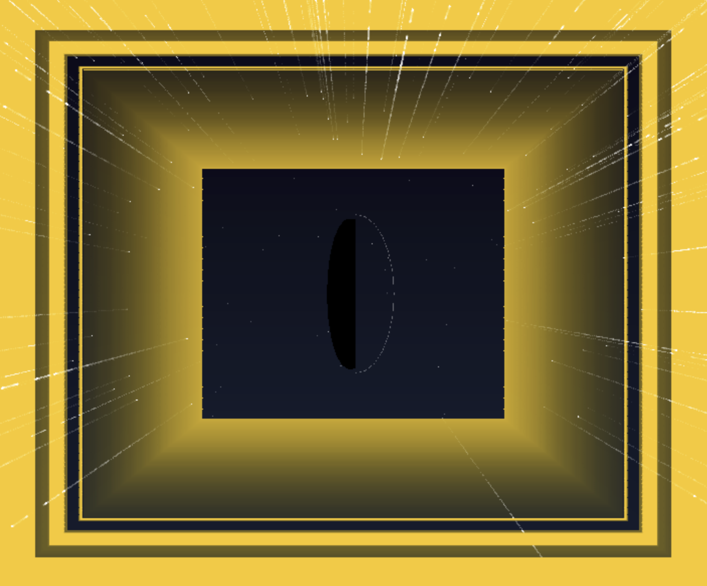
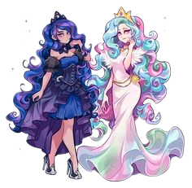

# Weekly Journal 14

## Exploration & Experimentation
Final week. Final presentations. Final me pretending I’m calm. The final project is my interactive Sun/Moon sketch, built in p5.js using WEBGL, where the central disc rotates and the whole scene transitions between warm “day” and cool “night.” The script is not a random pile of tricks; it’s the end result of everything I kept circling around all semester: cycles (Week 3), machines (Week 4), atmosphere (Week 5), characters/faces (Week 7), gradients and controlled transitions (Week 8 onward), and finally: motion that feels physical (Weeks 12–13).

The interaction is based on dragging and inertial rotation. When I drag, I update the target rotation and velocity; when I release, the disc keeps spinning and slowly eases down like an object with friction. The visuals respond to the rotation: the background blends between palettes, a gradient shifts, stars fade in during night, and the disc face changes expression so the mood reads instantly.

[Image: Final Sun/Moon sketch showing a rotating disc, gradient atmosphere, and stars fading depending on state.]

## Influences & References
The sun and moon aren’t just cute icons; they’re a structured way to talk about contrast, mood shifts, and the idea that both states exist in the same system (reference to my little pony, the royal sisters).  

It also connects back to my earlier references: The Starry Night taught me that night can be alive and textured, and the face studies taught me that expression can make a system emotionally legible without needing explanation. The choice to use warm/cool palettes isn’t just aesthetic, it's a tribute to my hobbies as mentioned in the presentation.

## Algorithmic Thinking
The “machine imaginaire” is a rotation-driven state machine with easing. The script sets up angle, targetAngle, and angularVelocity, plus interaction flags like isDragging and lastX. While dragging, horizontal movement (dx) updates rotation targets and velocity. When not dragging, the system continues motion with friction (angularVelocity *= 0.95), so it gradually settles instead of stopping abruptly. The angle is wrapped so it stays within [(0, TWO_PI)].

Then the important part: the rotation becomes a state value. The script maps angle into t in [0, 1] using a sine relationship, then applies an easeInOut() function so transitions feel smooth and natural. That eased value drives everything: background color blending via lerpColor, a vertical gradient drawn line-by-line, disc material color blending between moon and sun palettes, and star opacity fading in/out. Stars are precomputed and twinkle using a sinusoidal function so night feels alive, not static. The face logic switches direction based on state so the “sun” side reads happier and the “moon” side reads gentler, with extra details like rays versus crater-like dots to reinforce the identity.

And because I apparently can’t resist making things interactive in multiple ways, the script also supports keyboard controls: jump to day/night, save an image, or spin with arrow keys. The whole system is one idea repeated consistently: one hidden state variable controls many visible changes.

## Critical Reflection
What worked:  
Making one central object carry the whole theme. The disc became my anchor, and everything else (gradient, stars, face details) supports it instead of competing with it. Easing was the secret sauce, without it, the transition would feel like a cheap slider; with it, it feels like a cycle that has rhythm. The inertial rotation also made the interaction feel physical, which matches the idea of turning from night to day instead of toggling it like a light switch.

What failed:  
I had to fight my instinct to add too much. Every extra decorative element risked turning the sketch into noise. The best decision I made was choosing clarity over clutter. During critique, what I said exactly is XYZ UNCERTAIN, but the internal conclusion I’m keeping is clear: generative work looks strongest when the system is readable and the aesthetic choices serve the concept.

Next step (if I extend this later):  
Explore a richer “twilight” region between sun and moon, something subtle, not a third mode, but a more complex blend. But for this course, the final project feels like a real conclusion: the semester started with me losing work and drawing simple faces, and it ended with me building a controlled, interactive cycle where light and dark continuously trade places without either one being “the end.”